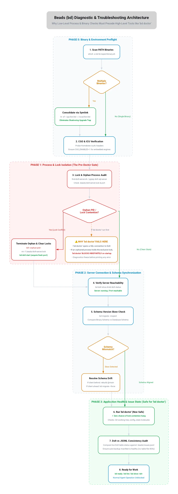

# bd / Dolt Troubleshooter

`bd` (beads) stores issues in a Dolt database under `.beads/` and exports them to
`.beads/issues.jsonl` (the file committed to git). Most operational failures come
from a mismatch between four layers:

0. **Engine mode** — embedded (in-process) or server (external `dolt sql-server`).
   Mode controls which data directory is used and which database name constraints
   apply. Everything else depends on this being correct. Check with `bd dolt show`.
1. **Dolt server** — the live database (`.beads/dolt/` in server mode, `.beads/embeddeddolt/` in embedded mode)
2. **JSONL export** — `.beads/issues.jsonl` (git source of truth)
3. **Auto-backup** — `.beads/backup/` (a local Dolt backup target)

## The Signature Failure: Writes Silently Revert

**Symptom:** You run `bd close X` or `bd update X`, bd prints success, but the
change is gone on the next command. `bd show X` and `.beads/issues.jsonl`
disagree, or both revert to the old state.

**Tell-tale log line** (in `.beads/dolt-server.log`):
```
auto-backup failed: sync to backup: sync backup backup_export:
Error 1105 (HY000): error opening table file: table file not found:
.beads/backup/<hash>
```

### Root-cause chain

1. The `.beads/backup/` Dolt backup is **corrupt** — its `manifest` references
   table files that no longer exist on disk.
2. On every invocation bd **auto-imports** `issues.jsonl` into a working DB
   ("auto-importing into empty database").
3. After a write, bd tries to **export** to `issues.jsonl` and **sync to backup**.
   The backup sync fails, and the export does not land.
4. The **next** bd command auto-imports the now-stale `issues.jsonl`, which
   **reverts** the previous write before applying the new one.

The result is a write-rollback loop where only one change "sticks" at a time and
even that is unreliable.

### Why it recurs across clones

If `.beads/backup/` was ever committed to git (despite being listed in
`.beads/.gitignore`), the corruption travels with the repo. Git honors tracking
over `.gitignore`, so a file added before the ignore rule stays tracked.

## The Hook-Timeout Stash-Wipe (untracked files vanish after a commit)

**Symptom:** Untracked files (drafts, new posts, uncommitted work) disappear from the
working tree after a `git commit`. `git stash list` shows a new stash with message
`WIP on <branch>: <hash> <msg>`. The untracked files are in `stash@{0}^3`.

**Root-cause chain:**

1. bd's git hooks (pre-commit, post-commit, etc.) run `bd hooks run …` on every commit.
2. bd's sync does a `git stash -u` (includes untracked files) to get a clean tree for
   Dolt ref work.
3. The hook runs under a `timeout` (default 30s). If Dolt sync takes longer, the
   timeout fires, the hook prints "continuing without beads" and exits — **without
   popping the stash**.
4. The working tree stays at the stashed state: untracked files are gone, tracked files
   are reverted to HEAD.

**Identify:** Check whether the stash was bd-caused (has an untracked section):
```bash
git stash list            # look for unexpected stash@{0}
git ls-tree -r --name-only stash@{0}^3 2>/dev/null  # non-empty = -u stash, likely bd
```

**Immediate recovery:** restore untracked files from the stash without disturbing
anything committed since:
```bash
# Restore individual files from the untracked tree (stash@{0}^3)
git show stash@{0}^3:<path/to/file> > <path/to/file>
# Or restore all untracked files at once (safe if working tree is clean):
git checkout stash@{0}^3 -- .
# Then drop the stash once everything is confirmed on disk and committed:
git stash drop stash@{0}
```

**Permanent fixes (apply both):**

Fix 1 — Raise the hook timeout in your shell profile so the stash-and-pop completes
before the timeout bails:
```bash
# ~/.zshrc or ~/.bashrc
export BEADS_HOOK_TIMEOUT=120   # was 30; 2 min covers slow Dolt sync
```

Fix 2 — In repos where beads is unused (no issues, no `issues.jsonl`, no remote),
disable the hooks entirely — they add no value and carry real risk:
```bash
cd .git/hooks
for h in pre-commit post-commit post-checkout post-merge pre-push prepare-commit-msg; do
  [ -f "$h" ] && mv "$h" "$h.disabled"
done
```
Detect an unused beads repo: `bd dolt show` shows embedded mode with no remote, and
`bd list` returns "No issues found" with no `issues.jsonl` on disk.

Reverse: `for h in *.disabled; do mv "$h" "${h%.disabled}"; done`

**Check all repos for bd-caused orphaned stashes:**
```bash
for dir in $(find ~/projects -maxdepth 1 -type d); do
  [ -d "$dir/.git" ] || continue
  stash=$(git -C "$dir" stash list 2>/dev/null)
  [ -z "$stash" ] && continue
  # Check for untracked section (^3) which indicates a -u stash
  while IFS= read -r entry; do
    ref=$(echo "$entry" | grep -o 'stash@{[0-9]*}')
    has_untracked=$(git -C "$dir" ls-tree -r --name-only "$ref^3" 2>/dev/null)
    [ -n "$has_untracked" ] && echo "bd-stash candidate: $dir  $entry"
  done <<< "$stash"
done
```

---

## The Orphaned dolt sql-server Process Leak

**Symptom:** `ps aux | grep "dolt sql-server"` shows multiple processes (each
80–160 MB RAM) on different ports. Memory usage grows across the day.

**Root cause:** Each beads repo in server mode spawns a `dolt sql-server` instance.
If the bd daemon exits uncleanly (timeout, SIGKILL, machine sleep) without sending
SIGTERM to its server, the process is orphaned. Repeated bd invocations across many
repos accumulate leaked servers.

**Identify and reap:**
```bash
# Count
pgrep -c -f "dolt sql-server"

# Reap gracefully (SIGTERM allows Dolt to flush)
pkill -TERM -f "dolt sql-server"
sleep 3
pgrep -c -f "dolt sql-server"   # should be 0; if not, use SIGKILL
```

Servers restart automatically on the next `bd` command in each repo. No data is lost
from a clean SIGTERM.

---

## Schema Version Skew

When `bd` database migrations occur across multi-agent environments or version upgrades, schema skew can block database operations or cause writes to fail.

See **[`references/schema-version-skew.md`](references/schema-version-skew.md)** for detailed troubleshooting and recovery runbooks covering:
1. **Remote-Backed Database Migration Blocks** (client ahead of DB, auto-migrations refused on remote clones)
2. **Client Behind the Database** (database migrated forward, older client writes fail)
3. **DB Migrated by Unreleased Build** (development build migration with no newer release available)

---

## Diagnostic Architecture & Execution Flow

```
┌────────────────────────────────────────────────────────┐
│ Phase 3: Application Health & Issues (bd doctor)       │  ← FAILS/HANGS if Phase 1 or 0 is broken
├────────────────────────────────────────────────────────┤
│ Phase 2: Database Protocol & Schema (bd migrate)       │
├────────────────────────────────────────────────────────┤
│ Phase 1: OS Process & Lock Layer (.beads/dolt-server)  │  ← Single exclusive file lock
├────────────────────────────────────────────────────────┤
│ Phase 0: Binary & PATH Resolution (PATH, CGO, ICU)     │  ← Determines which binary executes
└────────────────────────────────────────────────────────┘
```

> **Why `bd doctor` is NOT the first step:** `bd doctor` is a high-level tool that attempts to initialize an in-memory client or connect to the running Dolt server. If an orphaned `dolt sql-server` process holds the exclusive file lock on `.beads/dolt/`, `bd doctor` **blocks indefinitely on startup** without printing errors. Similarly, if multiple `bd` binaries shadow your PATH, `bd doctor` may execute an outdated pure-Go binary and report spurious errors.



## Quick Diagnosis

**Start here — four commands in order:**

```bash
# 0. Check for orphaned servers or lock contention first (prevents hanging)
scripts/find-dolt-server.sh

# 1. Read cached daemon failure if present
cat .beads/daemon-error 2>/dev/null

# 2. Reveal engine mode, data directory, and server connection status
bd dolt show

# 3. Check schema version and pending migrations
bd migrate --inspect

# 4. Now safely run doctor (lock and binary preflights cleared)
bd doctor
```

Then run the bundled diagnostic for deeper checks (read-only, safe):

```bash
scripts/diagnose.sh
```

It checks, in order:
- Engine mode and whether a `daemon-error` file is present
- Schema version skew warnings and whether duplicate `bd` binaries shadow your PATH
- Dolt server status and recent backup errors in the log
- Whether `.beads/backup/` or `dolt-server.*` runtime files are git-**tracked**
  (they should not be)
- Whether `bd show` (Dolt) agrees with `.beads/issues.jsonl` for a sample issue
- Whether the backup `manifest` references missing table files

To inspect git commit revision hashes across all installed `bd` client binaries:

```bash
scripts/inspect-binary.sh
```

## Repair

Run the repair (makes changes — review first, commit after):

```bash
scripts/repair-corrupt-backup.sh
```

What it does:
1. `bd dolt stop`
2. Moves the corrupt `.beads/backup/` aside to `.beads/backup.corrupt.<ts>/`
3. `bd dolt start` (bd recreates a fresh, valid backup)
4. `git rm --cached` any tracked `.beads/backup/*` and `dolt-server.*` files so
   `.gitignore` finally takes effect
5. Deletes the moved-aside corrupt copy
6. Forces a clean export: `bd export -o .beads/issues.jsonl`

After repair, **verify** before committing (see below), then:
```bash
git add .beads/issues.jsonl
git commit -m "chore(bd): untrack corrupt dolt backup; resync issues.jsonl"
```

## The Golden Rules

1. **JSONL is the source of truth for git.** After any batch of bd writes, run
   `bd export -o .beads/issues.jsonl` and diff it before committing.
2. **Never commit `.beads/backup/` or `.beads/dolt-server.*`.** They are
   machine-local. If they show in `git ls-files`, untrack them.
3. **Verify, don't trust, the success message.** bd printing "Closed X" is not
   proof of persistence during a corruption episode. Re-read with `bd show X`
   *and* grep the JSONL.
4. **Batch writes, then one export.** Because each command re-imports JSONL,
   apply all mutations, confirm Dolt state with `bd show`, then export once.
5. **Commit before bd operations.** Untracked files are the most vulnerable to
   the hook-timeout stash-wipe. If a file matters, commit it before running
   anything that triggers a git hook.
6. **Set `BEADS_HOOK_TIMEOUT=120` in your shell profile.** The 30s default is
   too short for Dolt sync on slow or cold connections and causes orphaned stashes.
7. **Disable hooks in repos where beads is unused.** An empty beads repo (no
   issues, no JSONL, no remote) with active hooks is a net liability. Detect with
   `bd list` and `bd dolt show`; disable as shown above.
8. **`bd --version` lies when the binary is a dev build.** A binary built from
   local source shows the same version string as the published tag it was branched
   from, but may be many commits — and schema migrations — ahead. `(dev)` in the
   output is a red flag. Always verify with `go version -m "$(which bd)"` and
   compare the `mod` pseudo-version hash across all machines sharing a database.
9. **"Upgrade to latest" assumes a newer release exists — verify first.** Before
   prescribing `go install …@latest` for a schema-skew fix, run
   `go list -m -versions github.com/steveyegge/beads` and compare against the
   installed tag. If you're already on the latest tag and the DB is still ahead,
   the DB was migrated by an unreleased/`main` build — you need that specific
   commit (`go install …@<commit>`), not a repeat of the same tag.
10. **A repo-fingerprint mismatch after adding a remote late is expected, not
    corruption.** `bd init` computes `repo_id` from `git config remote.origin.url`
    when available, falling back to `sha256(realpath(repo_root))` when no remote
    is configured yet. If you `bd init` before running `git remote add origin`,
    the stored fingerprint is path-based; once a remote exists, `bd doctor`'s live
    check recomputes a URL-based fingerprint and the two will never match. Fix
    with `echo y | bd migrate --update-repo-id` (only if you're sure no other clone depends
    on the old ID) rather than `rm -rf .beads && bd init`.
11. **Use non-interactive flags when repairing in autonomous/agent environments.**
    Interactive prompts will time out or cancel in non-interactive agent sessions:
    - `bd doctor --fix --yes` (auto-applies all fixable doctor issues)
    - `echo y | bd migrate --update-repo-id` (bypasses interactive confirmation for repo ID updates)
    - `bd migrate --force` / `BD_ALLOW_REMOTE_MIGRATE=1 bd migrate` (overrides remote schema gate on designated migrator)
12. **Resolve "Dolt Remote vs Git Origin" endpoint conflicts using config.**
    When `bd doctor` warns that a Dolt remote shares the same URL as git origin, run `bd config set dolt.local-only true` or remove the conflicting Dolt remote (`bd dolt remote remove origin`).

## Manual Verification Snippet

Confirm Dolt and JSONL agree for specific issues:

```bash
for id in a2ac-d9l a2ac-aqj; do
  dolt=$(bd show "$id" --json 2>/dev/null \
    | python3 -c "import json,sys;d=json.load(sys.stdin);i=d[0] if isinstance(d,list) else d;print(i['status'])")
  jsonl=$(python3 -c "
import json
for l in open('.beads/issues.jsonl'):
    if l.strip():
        i=json.loads(l)
        if i['id']=='$id': print(i['status'])")
  echo "$id  dolt=$dolt  jsonl=$jsonl  $([ "$dolt" = "$jsonl" ] && echo OK || echo MISMATCH)"
done
```

## Lock Contention: Multiple `dolt sql-server` Processes

**Symptom:** `bd dolt start` reports `server started (PID N) but not accepting
connections … timeout`, and `.beads/dolt-server.log` repeats `database "dolt" is
locked by another dolt process`. Dolt allows only **one** server per data
directory (a single exclusive write lock). This happens when many projects each
run a server, or a bind-mounted `.beads/` is shared by a host + container.

**Never blanket-kill `dolt sql-server` — you'd disrupt other projects.** Isolate
the server bound to *this* repo by its working directory:

```bash
scripts/find-dolt-server.sh          # lists all servers with PID + CWD; marks THIS repo's
```

Then stop only that one (`bd dolt stop` from the repo root is scoped to this
project), clear stale runtime files, and start the single owner. Full steps:
`references/recovery-playbook.md` → **Case F**. For the bind-mount host/container
variant, one machine owns the server and the other stays Dolt-free — see the
project `AGENTS.md`.

## Related References

- `references/schema-version-skew.md` — detailed runbooks for schema version skew (remote migration blocks, client behind DB, unreleased builds)
- `references/symptoms.md` — symptom → cause → fix lookup table
- `references/recovery-playbook.md` — step-by-step recovery for harder cases
  (lost writes, divergent Dolt vs JSONL, restoring from `bd backup`, and
  multi-server lock contention in Case F)
- `references/cgo-and-schema-drift.md` — detailed runbook on CGO ICU dependencies,
  pure-Go degraded test warnings, multi-agent `@main` schema drift, and cross-platform compilation
- `scripts/diagnose.sh` — read-only (or `--probe` for write test): primary health check for engine mode, schema skew, repo fingerprint, PATH shadowing, backup corruption, and Dolt/JSONL agreement
- `scripts/repair.sh` — unified automated repair: creates a raw snapshot backup, clears corrupt backup files, applies schema migrations (`--force`), updates repo fingerprints, untracks local files, runs `bd doctor --fix --yes`, and exports clean JSONL
- `scripts/repair-corrupt-backup.sh` — targeted repair for corrupt backup write-rollback loops
- `scripts/restore-bd.sh` — utility to rebuild `bd` against `@main` with full CGO/ICU support
  and automatically synchronize shadowed PATH binaries across macOS and Linux
- `scripts/find-dolt-server.sh` — read-only: list all `dolt sql-server` PIDs with
  their working dirs and flag the one owning the current repo's `.beads/`
- `scripts/inspect-binary.sh` — read-only: scan PATH for installed `bd` binaries,
  extract Go build metadata (pseudo-versions, timestamps, git commits), and detect PATH shadowing
- `assets/process-flow.webp` / `assets/process-flow.dot` — architectural diagram and diagnostic phase execution flowchart (Light Theme)
